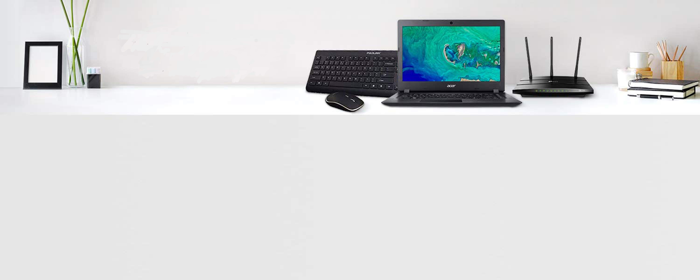
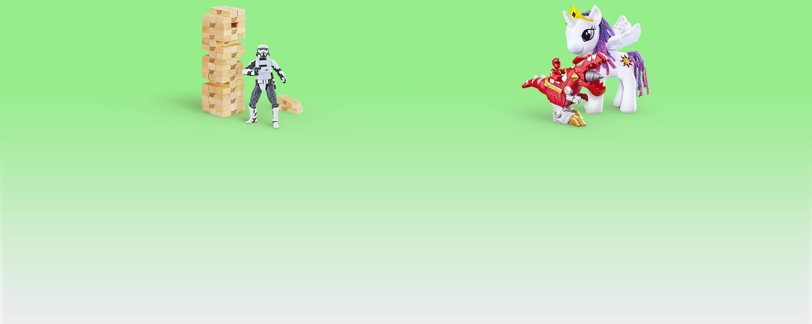

<p align="center">
  
</p>

<h1 align="center">Amazon Clone</h1>

<p align="center">
  A full-stack e-commerce storefront built with <b>Next.js</b>, <b>TypeScript</b>, <b>Firebase</b>, <b>Redux Toolkit</b> and <b>Stripe</b>.
</p>

<p align="center">
  
</p>

<p align="center">
  
  
  
  
  
  
</p>

<p align="center">
  <a href="#-features">Features</a> •
  <a href="#-screenshots">Screenshots</a> •
  <a href="#-tech-stack">Tech Stack</a> •
  <a href="#-getting-started">Getting Started</a> •
  <a href="#-project-structure">Structure</a>
</p>

---

## 📸 Screenshots

<p align="center">
  
  <br/><sub><b>Home</b> — hero banner and category-based product feed</sub>
</p>

<table align="center">
<tr>
<td align="center">

<br/><sub>Electronics</sub>
</td>
<td align="center">

<br/><sub>Beauty</sub>
</td>
<td align="center">

<br/><sub>Toys</sub>
</td>
</tr>
</table>

> Swap in real product/cart/checkout screenshots as the app evolves — these are pulled from the existing `public/` assets.

## ✅ Features

- [x] 🛍️ Product feed sourced from the Fake Store API
- [x] 🛒 Persistent shopping cart with Redux Toolkit
- [x] 🔐 Authentication via NextAuth
- [x] 💳 Secure checkout with Stripe Checkout Sessions
- [x] 🔔 Stripe webhook handling for order fulfillment
- [x] 🔥 Order history stored and retrieved from Firebase
- [x] 📱 Responsive UI styled with Tailwind CSS
- [x] ⚡ Server-side rendering with Next.js `getServerSideProps`

## 🛠️ Tech Stack

<div align="center">

</div>

## 📂 Project Structure

```
amazon-clone/
├── components/          # UI components (NavBar, ProductFeed, Cart, Footer, ...)
├── pages/
│   ├── api/
│   │   ├── auth/        # NextAuth configuration
│   │   ├── checkout/     # Stripe checkout session endpoint
│   │   └── webhook/       # Stripe webhook handler
│   ├── cart/              # Cart page
│   ├── orders/             # Order history page
│   └── index.tsx            # Home page
├── redux/                     # Redux store & cart slice
├── Firebase/                    # Firebase client config
├── lib/                           # Stripe client helper
├── utilities/                       # Formatting helpers
├── public/                            # Static assets & screenshots
└── styles/                              # Global Tailwind styles
```

## ⚡ Getting Started

### Prerequisites
- [Node.js](https://nodejs.org/) 16+
- A [Firebase](https://firebase.google.com/) project
- A [Stripe](https://stripe.com/) account (test mode keys are fine)

### Installation

```bash
git clone https://github.com/Tumelo4/amazon-clone.git
cd amazon-clone
npm install
```

### Environment Variables

Create a `.env.local` file in the project root:

```env
NEXTAUTH_SECRET=
GOOGLE_CLIENT_ID=
GOOGLE_CLIENT_SECRET=

NEXT_PUBLIC_FIREBASE_API_KEY=
NEXT_PUBLIC_FIREBASE_AUTH_DOMAIN=
NEXT_PUBLIC_FIREBASE_PROJECT_ID=

STRIPE_SECRET_KEY=
NEXT_PUBLIC_STRIPE_PUBLIC_KEY=
STRIPE_SIGNING_SECRET=
```

### Run the app

```bash
npm run dev
```

Open [http://localhost:3000](http://localhost:3000) 🎉

## 🤝 Contributing

1. Fork the project
2. Create your feature branch (`git checkout -b feature/AmazingFeature`)
3. Commit your changes (`git commit -m 'Add some AmazingFeature'`)
4. Push to the branch (`git push origin feature/AmazingFeature`)
5. Open a Pull Request

## 📄 License

See the [LICENSE](LICENSE) file for details.

---

<p align="center">
  
</p>

<p align="center">
  <sub>Built with Next.js, TypeScript & Stripe</sub>
</p>